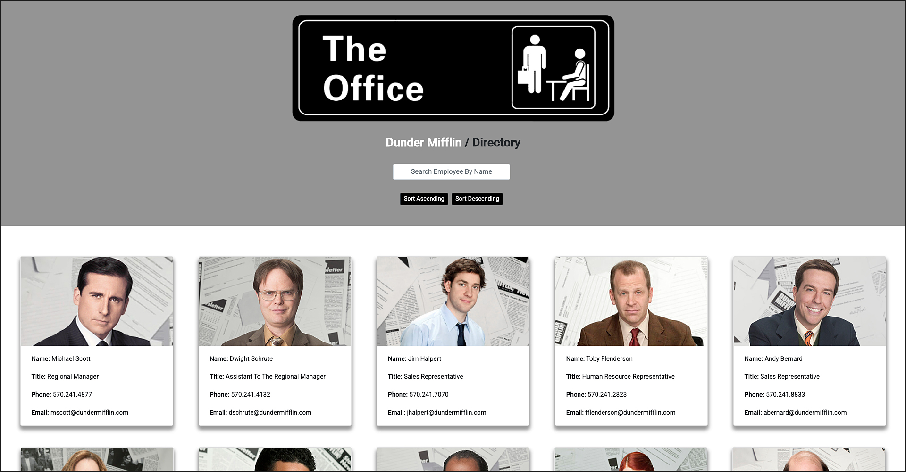

# Dunder Mifflin / Directory

‎
‎‎ 

 

   
  

  ---
  
  
&nbsp;

    

## Description 

&nbsp;

<strong><em>What is this project? Why did you make this project? How did you make this project?</strong></em>

&nbsp;

Dunder Mifflin / Directory is a small employee directory application that i built using the `React.js` library.

(..ADDITIONAL TEXT TO BE ADDED SOON)

&nbsp;

View the application here =>‏‏‎ ‎‏‏‎ ‎‏‏‎ ‎‏‏[`Dunder Mifflin / Directory`](https://jonathanschimpf.github.io/Employee-Directory-ReactJS/)

&nbsp;

---

&nbsp;

## Table of Contents: 

&nbsp;

* [Usage](#usage)
* [License](#license)
* [Credits](#credits)
* [Questions](#questions)

&nbsp;

---

&nbsp;

## Usage

&nbsp;

<strong><em>Instructions and examples for usage + development details:</strong></em>

&nbsp;

Log on to:‏‏‎ ‎‏‏‎ ‎‎‏‏[`Dunder Mifflin / Directory`](https://jonathanschimpf.github.io/Employee-Directory-ReactJS/). 

(..ADDITIONAL TEXT TO BE ADDED)

&nbsp;

&nbsp;

 

&nbsp;

--- 

<!-- 
&nbsp;

 

&nbsp;

 

---

&nbsp;

&nbsp;
   

--- -->

&nbsp;

## License

&nbsp;

This project is covered under the MIT license. 

&nbsp;

---

&nbsp;

## Credits

&nbsp;

<strong><em>Third party assets:</strong></em>

&nbsp;

`React.js` =>‏‏‎ ‎ ‏‏‎ ‎[A declarative JavaScript library for building user interfaces.](https://reactjs.org/)

&nbsp;‏‏‎‏‏‎ ‎<strong>+</strong>

`Node.js` =>‏‏‎ ‎ ‏‏‎ ‎[An asynchronous event-driven runtime built on Chrome's V8 JavaScript engine.](https://nodejs.org/en/)

&nbsp;‏‏‎‏‏‎ ‎<strong>+</strong>

`Base64 Image Encoder` =>‏‏‎ ‎ ‏‏‎ ‎[Optimize your images and convert them to Base64 online.](https://www.base64-image.de/)

&nbsp;‏‏‎‏‏‎ ‎<strong>+</strong>

`React-Bootstrap` =>‏‏‎ ‎ ‏‏‎ ‎[The most popular front-end framework. Rebuilt for React.](https://react-bootstrap.github.io/)

&nbsp;‏‏‎‏‏‎ ‎<strong>+</strong>

`Bootstrap CDN` =>‏‏‎ ‎ ‏‏‎ ‎[An open-source CSS framework directed at responsive, mobile-first web development.](https://getbootstrap.com/)

&nbsp;‏‏‎‏‏‎ ‎<strong>+</strong>

`GitHub Pages` =>‏‏‎ ‎ ‏‏‎ ‎[Websites for you and your projects.](https://pages.github.com/)

&nbsp;

---

&nbsp;

## Questions?

&nbsp;

Shoot me an e-mail! => jonathan@jonathanschimpf.com

&nbsp;

Check out more of my work here on =>
[GitHub](http://github.com/jonathanschimpf)

&nbsp;

